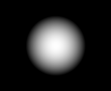

# C++からデータを吐いてPython側でPNGにするサンプル

## 使い方

```sh
g++ save.cpp
./a.out
python3 load.py
```

もしくは

```sh
make
```

実行には`NumPy`と`Pillow`が必要なので、適宜インストールしておく。venvを使うならこんな感じ。

```sh
python3 -m venv myenv
source myenv/bin/activate
python3 -m pip install --upgrade pip
python3 -m pip install numpy Pillow
```

## 解説

C++の`save.cpp`をコンパイルして実行。すると、`data.dat`ができる。これは

```cpp
const int row = 218;
const int column = 178;
float data[row][column];
```

の配列を保存したもの。

次に、Python側の`load.py`を実行すると、`data.dat`を読み込み、同じ次元のNumPy配列にする。その後、そのNumPy配列をPillowのImageに変換して`output.png`という名前で保存する。

`output.png`として、こんな画像が出力される。



## ライセンス

MIT
